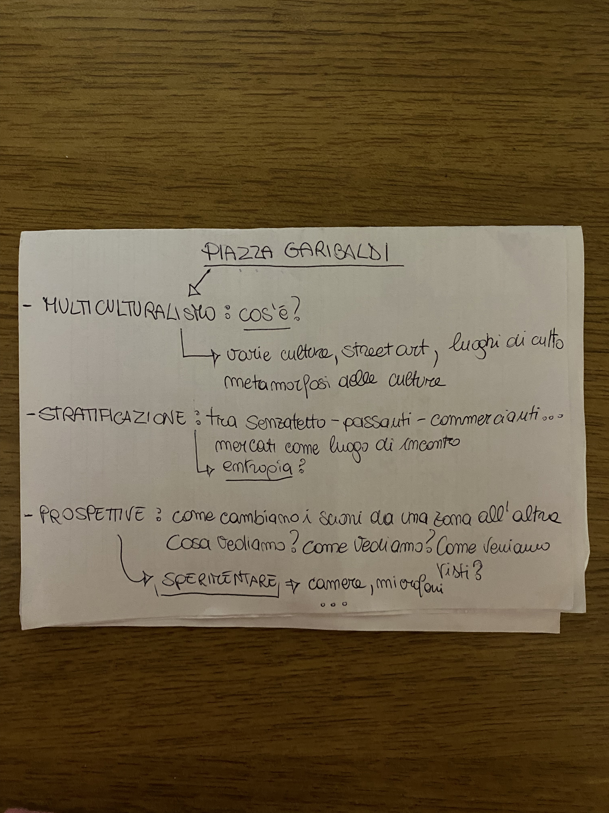

# RICERCHE VARIE

## Piazze
#A cosa servono le piazze?

In tutte le epoche storiche la piazza ha servito come luogo e centro di riunione dei cittadini disimpegnando massimamente queste funzioni: politica (comizî, parlamenti), commerciale (fiere, mercati), religiosa (processioni, sacre rappresentazioni, sagrati).
Dal latino platea, strada larga (greco plateia largo, spazioso), indica uno spazio libero, circondato da edifici di significativa qualità architettonica e di particolare prestigio civile o religioso che attribuiscono alla piazza funzioni diversificate in rapporto al tessuto sociale ed economico dell’abitato.

## Piazza Garibaldi
Piazza Garibaldi è una piazza di Napoli situata al limite dei quartieri Pendino, Mercato, San Lorenzo e Zona Industriale.
È una delle piazze più importanti e affollate della città in quanto dal 1866 si affaccia su di essa la stazione Napoli Centrale, nonché una stazione della linea 1, linea 2 e della Circumvesuviana.
La piazza nasce dopo l'Unità d'Italia, con il collocamento del nuovo scalo ferroviario lungo la strada dei fossi (attuale corso Garibaldi). Dapprima fu chiamata piazza della stazione o della Ferrovia fino al 1891 quando Giuseppe Saredo deliberò che si chiamasse piazza dell'Unità Italiana.

L'attuale assetto risale agli inizi anni sessanta del Novecento, quando la vecchia stazione fu demolita e ricostruita in posizione più arretrata; di conseguenza, la piazza fu notevolmente ingrandita e nel suo sottosuolo fu ricostruito lo scalo di Napoli Piazza Garibaldi ; l'odierna stazione venne completata nel 1960.

La nuova piazza tuttavia fu concepita esclusivamente per gestire il crescente traffico automobilistico e fu occupata al centro dalla cosiddetta proboscide che partiva dalla copertura della stazione: una grande pensilina per accogliere lo stazionamento degli autobus, demolita alla fine dell'anno 2000.

## Piazza Garibaldi Prima e Dopo
La porta della città non ha sempre avuto la conformazione attuale. Nel 1867 fu inaugurata la stazione storica in stile rinascimentale, demolita un secolo dopo.
La storia di piazza Garibaldi è legata a doppio filo a quello della stazione centrale. Prima del 1860, però, in quel luogo non c'era alcuno scalo ferroviario. Napoli era servita da due stazioni, entrambe collocate su quello che oggi conosciamo come corso Garibaldi. 
Solo nel 1867, fu realizzata una stazione centrale in quella che poi prese il nome di piazza Garibaldi. Si trattava di un edificio in stile rinascimentale con colonnato e rigogliosi giardini di fronte. Dal 1925, però, l'aumento del traffico ferroviario portò a una profonda trasformazione che dura ancora oggi. 

## ENTANGLEMENT
Entanglement" (in inglese, "groviglio", "intreccio") in meccanica quantistica indica un legame fra particelle. È definito da una funzione, chiamata funzione d'onda di un sistema, che descrive le proprietà delle particelle come fossero un unico oggetto, anche se le particelle si trovano ad enorme distanza. Questa correlazione permette alla prima particella di influenzare la seconda istantaneamente, e viceversa.

Paragone piazza garibaldi, intrecci su:  piano culturale, economico sociale

## Multiculturalismo

Il termine multiculturalismo identifica una società in cui più culture, anche molto differenti l'una dall'altra, convivono mantenendo ognuna la propria identità. Pur potendo avere interscambi, conservano quindi le peculiarità del proprio gruppo sociale. Le minoranze in particolare mantengono il loro diritto ad esistere, senza omologarsi o fondersi ad una cultura predominante, diluendo o perdendo quindi la propria identità.

## Toronto - MULTICULTURALISMO
Toronto è la metropoli più grande e cosmopolita del Canada, nonché la sua capitale culturale, economica e amministrativa. Con oltre 5 milioni di abitanti, è una città che si distingue per la sua estensione e per un incredibile mix etnico, che la rende la metropoli più multiculturale del pianeta. Abitata da persone provenienti da oltre 80 paesi, Toronto ospita una varietà di culture, tradizioni e lingue che coesistono armoniosamente, tra cui il cinese, l'italiano, lo spagnolo e il portoghese, oltre all'inglese e al francese. Ben 180 idiomi diversi sono parlati nella città, e il 51% dei suoi residenti è nato al di fuori del Canada.

Questa straordinaria diversità non è solo una caratteristica demografica, ma un vero e proprio elemento identitario che ha plasmato l’evoluzione di Toronto, conferendole un fascino unico. I suoi quartieri vivono di una straordinaria mescolanza culturale, dove ogni angolo racconta una storia diversa, dalla tradizione europea all’influenza asiatica, dall’impronta sudamericana alla cultura indiana e musulmana. Grazie alla sua apertura e alla convivenza pacifica tra etnie e nazionalità, Toronto è oggi una delle città più sicure del continente americano e la quarta più sicura al mondo.

Questa melodia multietnica è frutto di un lungo processo storico che affonda le radici nei primi abitanti della regione, i popoli Irochesi, che nel XV secolo erano già presenti nelle terre dove ora sorge Toronto. Il nome della città, che deriva probabilmente dalla lingua irochesa, potrebbe significare "luogo di incontro" o "terra dagli alberi nell'acqua", testimoniando un legame profondo con la natura e la convivialità.

Toronto è anche una città che ha visto crescere una fiorente comunità di immigrati italiani, che dopo la Seconda Guerra Mondiale hanno contribuito in modo significativo allo sviluppo economico e sociale del Paese. Con circa 1,3 milioni di italo-canadesi, il Canada ospita la sesta più grande comunità italiana al mondo, e nell'area di Toronto vivono circa 429.380 persone di origine italiana. L'italiano è la terza lingua più parlata nel Paese e la prima tra quelle non ufficiali, un segno tangibile dell'importante eredità culturale che gli italiani hanno lasciato e continuano a lasciare nella città.

Toronto è, insomma, una città dalle mille sfaccettature, che ha saputo integrare passato e presente, tradizione e innovazione, creando un ambiente dove culture diverse non solo coesistono, ma si influenzano reciprocamente, dando vita a una comunità dinamica e sempre in evoluzione. Una città che si è meritata una reputazione brillante, tanto da essere una delle mete preferite da expat, turisti e imprenditori di tutto il mondo.

# Metodo transdisciplinare
Il metodo transdisciplinare è un approccio all'apprendimento, alla ricerca e alla risoluzione dei problemi che supera i confini delle singole discipline tradizionali (come matematica, storia, scienze, ecc.), integrando conoscenze, metodi e prospettive provenienti da più ambiti, spesso coinvolgendo anche saperi non accademici (come esperienze pratiche, intuizioni artistiche, tradizioni locali, ecc.).

Caratteristiche principali del metodo transdisciplinare:

- Oltre la multidisciplinarità: mentre l’approccio multidisciplinare mette insieme più discipline affiancandole, il transdisciplinare mira a fondere e trascendere i confini tra le discipline.
- Collaborazione attiva: coinvolge spesso ricercatori, professionisti e cittadini, valorizzando diversi tipi di conoscenze.
- Centralità del problema: il focus è su un problema complesso reale, non su una disciplina specifica.
- Approccio sistemico: considera le interconnessioni tra i vari elementi del problema.
- Visione olistica: cerca una comprensione globale, non frammentata.

##APPUNTI 

