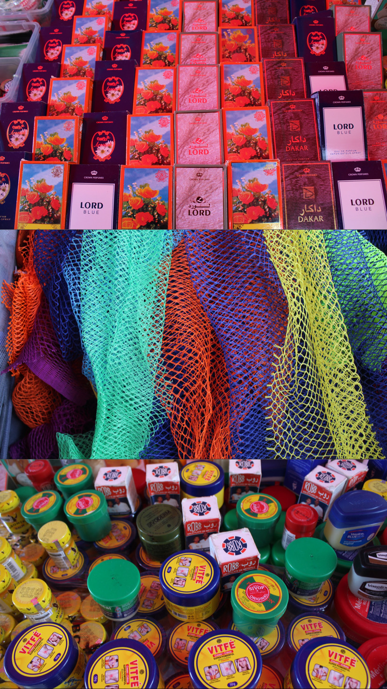

# PERSONE, ESPERIENZE

# Mohamed

 

Mohamed è un ragazzo tunisino di 19 anni arrivato a Napoli 4 mesi fa, parla solo l'arabo e qualche parola in italiano. 
Di conseguenza riuscire ad avere una conversazione con lui è veramente complicato. Ma pian piano ci siamo riusciti.
Mohamed va a scuola e, dovendo partire da capo, l'altra volta era ai tavolini della portineria a scrivere le lettere dell'alfabeto. 
Mi sono seduta con lui e l'ho aiutato. Mi ha colpito vederlo così dedito ad imparare. Non è scontato.
Più di una volta l'ho visto comprare il pranzo e distribuirlo a chi ne aveva bisogno. Mi sono quasi commossa.
Una volta invece ha dato dei soldi per comprare il pranzo ad un ragazzo con evidenti problemi psichici che girovaga sempre in piazza.
Mohamed mi scalda il cuore con questi piccoli gesti, mi insegna ogni giorno cose nuove, anche se lui non lo sa. 

# Amina

Amina è una donna senegalese che ha un ristorante col marito in via Milano. E' qui a Napoli da ormai 15 anni, ha una figlia, Fatima 8 anni, che abbiamo conosciuto, e un altro figlio che è in Senegal. Abbiamo avuto il piacere di conoscerli e sono stati gentilissimi e disponibili nei nostri confronti; così per ricambiare la stessa moneta, abbiamo stampato e donato loro delle foto che i ragazzi scattarono nel ristorante in precedenza.

# Abdoul
Abdoul è un commerciante del mercato senegalese che abbiamo conosciuto in questi giorni, e ci ha permesso di fare alcuni scatti ai suoi prodotti esportati dall'Arabia.

# Momo (Mohamed)